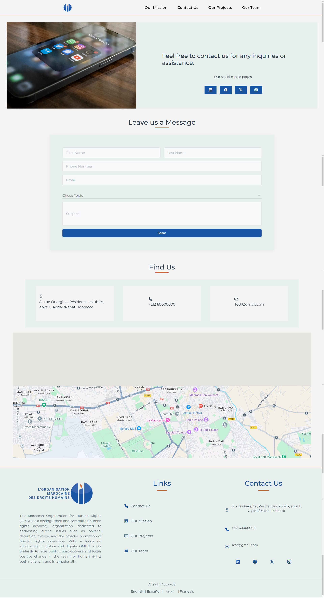
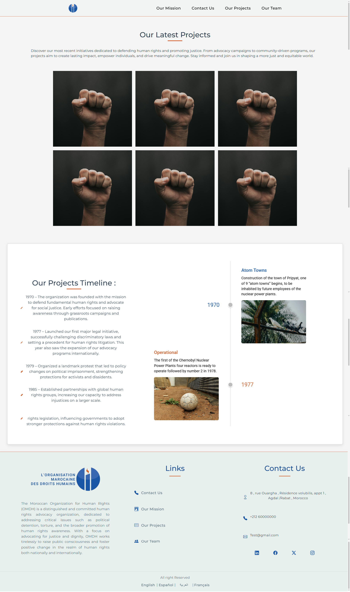

# 🌐 OMDH Vitrine Website

## Empowering Human Rights Advocacy Through a Modern Digital Platform

I am developing a robust, modern web platform for the **Moroccan Organization for Human Rights (OMDH)** to elevate its mission, vision, and initiatives. Built with **Blazor Server**, this solution delivers a fast, interactive, and scalable user experience—focusing on visibility, accessibility, and digital empowerment.

Leveraging the real-time capabilities of Blazor Server, the website ensures dynamic interactions and seamless communication between the client and server. This choice enables OMDH to maintain a strong, professional digital presence while focusing on what truly matters: defending human rights.

---

## 🧩 Key Features

### ✨ Digital Showcase

- **Modern, elegant design** reflecting OMDH’s commitment to justice and dignity.  
- **Structured, mission-driven content** highlighting campaigns, initiatives, and accomplishments.  
- **Interactive sections** for exploring reports, articles, and organizational updates.  
- **Multilingual interface** to serve both Moroccan and international audiences.  

### 👥 User-Centric Experience

- **Smart contact forms** for general inquiries, volunteer registration, and donations.  
- **Dynamic event calendar** to promote workshops, seminars, and advocacy events.  
- **Integrated blog and news feeds** for updates on human rights in Morocco and beyond.  
- **Built-in donation system** for direct contributions to OMDH's causes.  
- **Social media integration** to encourage awareness and sharing across platforms.  

### ⚙️ Admin & Performance Tools

- **Content management panel** for easy updates on events, articles, and donation tracking.  
- **SEO-optimized structure** to maximize visibility and search engine performance.  
- **SSL and secure architecture** to protect user data and ensure trustworthy communication.  
- **Performance monitoring tools** to assess site reach, responsiveness, and engagement.  

---

## ⚡ Why Blazor Server?

### 🧠 Real-Time, Interactive UX

Blazor Server enables real-time interactions by maintaining a persistent connection between the server and client. This architecture eliminates unnecessary page reloads and allows for immediate content updates, perfect for showcasing live news, upcoming events, and social engagement.

### 🪶 Lightweight on the Client

By handling UI logic server-side, Blazor Server reduces the processing burden on users’ devices—providing snappy performance even on lower-end hardware or poor connections.

### 🔒 Security-First Architecture

Sensitive operations and logic reside on the server, minimizing risk of data exposure. Authentication, data validation, and API handling remain centralized and secure.

### 🔗 .NET Ecosystem Integration

Tightly integrated with the .NET stack, the platform benefits from powerful tooling, easy deployment, and scalable architecture—ideal for long-term growth and maintenance.

### 🚀 Rapid Development

Blazor Server and .NET libraries enable rapid prototyping and delivery, reducing time-to-market while maintaining code quality and security.

---

## 🏗️ Technical Stack

The platform is powered by a scalable, enterprise-ready tech stack:

- **Frontend**: Blazor Server for real-time, responsive UI experiences.  
- **Backend**: ASP.NET Core Web API for handling services, logic, and integrations.  
- **Database**: SQL Server (or alternative) for managing users, events, content, and donations.  
- **Security**: SSL encryption and secure access controls to protect user data and site integrity.  
- **Real-Time Updates**: SignalR for live content refresh, messaging, and notifications.  
- **Deployment**: Microsoft Azure for robust cloud hosting, performance, and scalability.  

---

## 🎯 OMDH Digital Advantage

This project brings critical value to the organization:

- ✅ **Increased Visibility** — Promotes OMDH’s mission and activities to a global audience.  
- ✅ **User Engagement** — Visitors can explore, interact, and contribute to OMDH’s work.  
- ✅ **Operational Efficiency** — Simplified content and event management for the OMDH team.  
- ✅ **Security & Reliability** — Real-time data delivery backed by robust server-side architecture.  
- ✅ **Accessibility for All** — Inclusive design ensures usability across devices and demographics.  
- ✅ **Maintainability** — Centralized architecture reduces complexity in maintenance and updates.  

---

## 📸 Project Preview
*Preview of the OMDH Vitrine Website - Homepage*
  

*Preview of the OMDH Vitrine Website - Our Missions*
  

*Preview of the OMDH Vitrine Website - Contact Us*
  

*Preview of the OMDH Vitrine Website - Our Projects*
  

*Preview of the OMDH Vitrine Website - Our Team*
  

---

## 📬 Contact

For project inquiries, collaborations, or support, please reach out:

- **📧 Email**: [abdellahjorf4@gmail.com](mailto:abdellahjorf4@gmail.com)  
- **📞 Phone**: +212 6752-42283  
- **🔗 LinkedIn**: [Abdellah Jorf](https://www.linkedin.com/in/abdellahjorf)  

